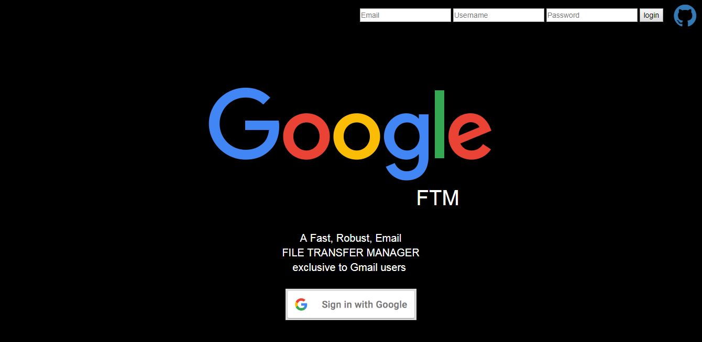

# GoogleFTM
A File Transfer Manager for Google -- with love NODEjs
<a href="https://googleftm.herokuapp.com/" target="_blank" >Link to Live App...</a>  

<h3>Installation</h3>
$ git clone https://github.com/attaab/GoogleFTM.git 
$ cd GoogleFTM 
$ npm install 
$ npm start 

Note: -  It might not be the best process out there, but hey! It works.#l0l
Join and upgrade OUR app..

<h3>Disclaimer</h3>
Regardless of its logo similarity and its name <h2>GoogleFTM</h2>
is not a software buildt and developed by <h4>Google.inc</h4>but rather is was buildt and developed by <h2>Ezekiel Saturday</h2>For practice purpose with Nodejs

<h4><a href='https://twitter.com/codefingers'>Twitter</a></h4>
